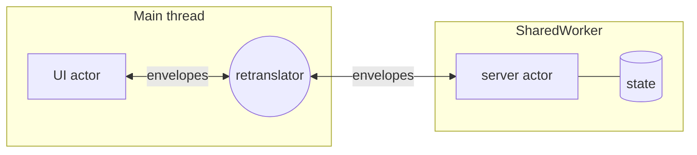
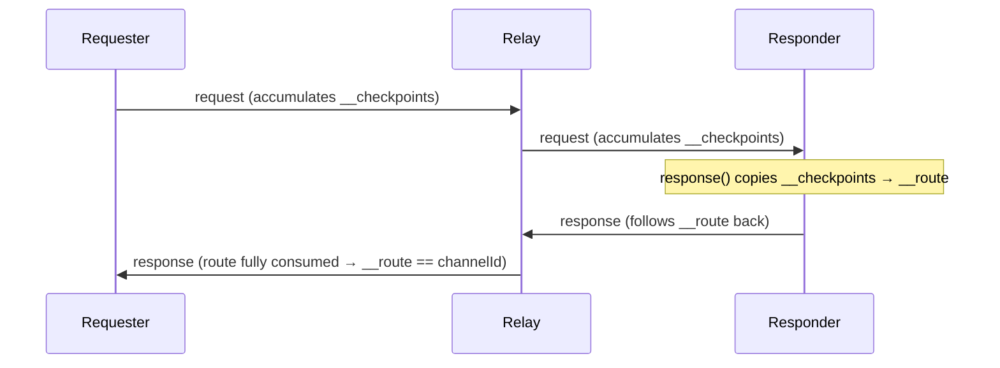

# webactor — Documentation

Complete reference for the actor model, its wire protocol, and every public API.

> New here? Read the [README](./README.md) first for the pitch and a quick tour. This document is the deep reference.

## Table of contents

- [1. Mental model](#1-mental-model)
- [2. Installation & environments](#2-installation--environments)
- [3. Envelopes — the unit of communication](#3-envelopes--the-unit-of-communication)
- [4. Actors](#4-actors)
- [5. Delivery semantics](#5-delivery-semantics)
- [6. Connecting actors & the routing model](#6-connecting-actors--the-routing-model)
- [7. Request / Response](#7-request--response)
- [8. Channels](#8-channels)
- [9. Topologies: dense network & retranslator](#9-topologies-dense-network--retranslator)
- [10. Workers](#10-workers)
- [11. Fault tolerance: supervisors](#11-fault-tolerance-supervisors)
- [12. Transferables](#12-transferables)
- [13. Environments & providers](#13-environments--providers)
- [14. Low-level building blocks](#14-low-level-building-blocks)
- [15. Full API reference](#15-full-api-reference)
- [16. Patterns & recipes](#16-patterns--recipes)
- [17. Gotchas & FAQ](#17-gotchas--faq)

---

## 1. Mental model

webactor has exactly one core abstraction and one wire format.

- **Transmitter** — anything you can `postMessage` to and `addEventListener('message', …)` on. An actor, a `MessagePort`, a `Worker`, a channel — they are all transmitters. Every function in the library speaks "transmitter", which is why the same code works in-thread and across a worker boundary.
- **Envelope** — the typed wrapper every message travels in: `{ type, data, … routing info }`.

Everything else — actors, connections, request/response, channels, supervisors — is built from those two ideas.



Design rules the model enforces:

1. **State is private.** An actor's variables live inside its constructor closure. The only way in or out is an envelope.
2. **Communication is explicit and asynchronous.** No synchronous cross-actor calls, ever.
3. **Location is transparent.** Wiring two actors in the same thread and wiring an actor to a worker use the same primitives and the same routing.

---

## 2. Installation & environments

```bash
npm install webactor
```

- Ships **ESM** (`dist/index.js`) with **TypeScript declarations** (`dist/index.d.ts`).
- **Zero runtime dependencies.**
- Targets modern browsers. In-thread messaging works everywhere. Some features need platform APIs:

| Feature                                         | Requires                                                 |
| ----------------------------------------------- | -------------------------------------------------------- |
| In-thread actors, connections, request/response | nothing special                                          |
| `openChannel` / `supportChannel`                | `MessageChannel` + **Web Locks API** (`navigator.locks`) |
| `applyWorkerSupervisor` liveness                | **Web Locks API**                                        |
| Workers                                         | `Worker` / `SharedWorker`                                |

To run outside the browser (Node, Vitest) inject polyfills via [providers](#13-environments--providers).

---

## 3. Envelopes — the unit of communication

Every message is wrapped in an **Envelope**:

```ts
type EnvelopeTypes = 'error' | 'close' | 'message' | 'messageerror';

type Envelope<T> = {
    readonly type: EnvelopeTypes;
    readonly data: T;
    readonly transferable?: Transferable[] | StructuredSerializeOptions;

    // internal routing metadata — set/maintained by the library
    __route: undefined | string;
    __checkpoints: undefined | string;
};
```

- `type` — one of `EnvelopeType.Message` (`'message'`), `EnvelopeType.Close` (`'close'`), `EnvelopeType.Error` (`'error'`), `EnvelopeType.MessageError` (`'messageerror'`).
- `data` — your payload. Must be structured-cloneable when crossing a worker boundary (see [Delivery semantics](#5-delivery-semantics)).
- `transferable` — objects to transfer rather than clone (see [Transferables](#12-transferables)).
- `__route` / `__checkpoints` — the routing breadcrumbs. You normally never touch these; the library reads and rewrites them as an envelope hops across connections. They're what make request/response and channels work across an arbitrary mesh. See [the routing model](#6-connecting-actors--the-routing-model).

### Helpers

```ts
function createEnvelope<T>(
    type: EnvelopeTypes,
    data: T,
    transferable?: Transferable[] | StructuredSerializeOptions,
    options?: { route?: string; checkpoints?: string },
): Envelope<T>;

function isEnvelope(v: unknown): v is Envelope<AnyData>;
function shallowCopyEnvelope<T extends Envelope<any>>(v: T): T;
```

Most of the time you **don't** create envelopes by hand. When you call `ctx.postMessage(x)` or `request(target, x)` with a raw value, the library wraps it into a `message` envelope for you. You only build one explicitly when you need a specific `type` or pre-set routing.

---

## 4. Actors

An actor is an isolated unit created from a name and a constructor.

```ts
import { createActor, ActorContext } from 'webactor';

const actor = createActor('my-actor', (ctx: ActorContext) => {
    // setup: state, listeners, timers…
    ctx.addEventListener('message', (envelope) => {
        // handle incoming messages
    });

    // optional: return a dispose function, called on close()
    return () => {
        /* cleanup timers, subscriptions… */
    };
});

actor.launch(); // runs the constructor
// …
actor.close(); // stops the actor and runs the dispose fn
```

### Types

```ts
type Actor = {
    name: string;
    launch: () => void;
    close: (reason?: unknown | Reason) => void;
    postMessage(msg, transferable?): void;
    addEventListener(type, cb): void;
    removeEventListener(type, cb): void;
};

// what the constructor receives — an Actor without `launch`
type ActorContext = {
    name: string;
    close: (reason?: unknown | Reason) => void;
    postMessage(msg, transferable?): void;
    addEventListener(type, cb): void;
    removeEventListener(type, cb): void;
};
```

### The two sides of an actor

An actor is internally a **pair of crossed mailboxes**. There is an _inside_ (the `ActorContext` your constructor gets) and an _outside_ (the `Actor` handle everyone else holds).

- Whatever the **outside** posts arrives at the **inside**'s `'message'` listeners.
- Whatever the **inside** (`ctx`) posts is emitted on the **outside** for connected transmitters to pick up.

That's why in the counter example the UI's messages reach the counter's `ctx.addEventListener('message', …)`, and the counter's `ctx.postMessage(...)` reaches the UI.

### Lifecycle

| Method           | Behavior                                                                                                                                           |
| ---------------- | -------------------------------------------------------------------------------------------------------------------------------------------------- |
| `launch()`       | Runs the constructor exactly once. Idempotent — a second call is a no-op.                                                                          |
| `close(reason?)` | Idempotent. Emits a `close` envelope (`{ data: { reason } }`) on the outside, closes both mailboxes, and calls the constructor's dispose function. |

`reason` flows to supervisors and to any `'close'` listener. Use a value from [`Reasons`](#reasons) or your own.

> **You must call `launch()`.** A created-but-not-launched actor never runs its constructor and silently ignores everything.

### Listening

```ts
ctx.addEventListener('message', (envelope) => {
    envelope.data;
});
ctx.addEventListener('close', (envelope) => {
    envelope.data.reason;
});
ctx.addEventListener('error', (envelope) => {
    envelope.data;
});
```

Callbacks receive the **Envelope**, not a DOM event. Read the payload from `envelope.data`.

---

## 5. Delivery semantics

Understand these three rules — they prevent 90% of "why didn't my message arrive" confusion.

1. **Delivery is always asynchronous.** The in-memory mailbox dispatches callbacks on a microtask (`Promise.resolve().then(...)`), even in the same thread. So right after `postMessage`, listeners have **not** run yet:

    ```ts
    ctx.postMessage({ type: 'x' });
    // listeners run later, on the next microtask — not on this line
    ```

    This intentionally matches the async nature of real `postMessage` across workers, so your code behaves the same in-thread and cross-thread.

2. **In-thread messages are passed by reference; cross-worker messages are structured-cloned.** Two actors in the same thread share the _same_ object you posted (mutating it after posting is a bug). The moment a message crosses a `Worker`/`SharedWorker` boundary the platform structured-clones it. Design payloads to be plain, cloneable data.

3. **Order is preserved per connection.** Messages sent over one connection arrive in the order they were sent.

### When a message does not make it

A failure of a single message is reported as a `messageerror` envelope carrying an `Error`. Keep it distinct
from `error`: an `error` envelope means the endpoint itself died and is what supervisors act on to decide a
restart, while a `messageerror` says one message was lost and the endpoint is fine.

```ts
ctx.addEventListener('messageerror', (envelope) => {
    console.warn('a message was lost:', envelope.data.message);
});
```

Two causes produce it:

- **Undeliverable** — a transport refused the payload on the way out, for example an unserializable
  transferable or a dead port. The `Error` is the one the transport threw; when the transport threw a
  non-error, its message is `Reasons.Undeliverable`.
- **Undeserializable** — a transport implementing the platform `messageerror` event reported that an
  incoming message could not be deserialized, with `Reasons.Undeserializable` as the message. Transports
  without the event — Electron's `MessagePortMain`, for one — simply never fire it, and such a message stays
  silently lost.

**Where the report goes.** A refused payload does not mean a broken link: an `Error` travels where a
transferable could not. So when the failed envelope was **routed** — a response, a channel handshake, in
short something with a party waiting on the far side — the report inherits that route and continues in the
same direction until it reaches them. A pending [`request`](#7-request--response) matching that route rejects
immediately with the original error instead of retrying into a wall.

Everything else is only meaningful locally, so it is delivered to the nearest endpoint and relayed no
further: a report with no route, and every `Undeserializable`. If even the report cannot be handed over, it
goes to `loggerProvider.error` — at that point there is nobody left to tell.

A throwing listener is a separate matter: it never reaches the peer at all. It is rethrown as an uncaught
error, exactly like a throwing DOM event listener, and the remaining listeners still receive the envelope.

---

## 6. Connecting actors & the routing model

### connectActors

```ts
function connectActors(a: Actor | ActorContext, b: Actor | ActorContext): VoidFunction;
```

Creates a **bidirectional** link and returns a `disconnect()` function. By default it forwards only `message` envelopes.

```ts
const disconnect = connectActors(ui, counter);
// …
disconnect();
```

### connectTransmitters (general form)

`connectActors` is a thin wrapper over the general primitive, which works on _any_ transmitters and lets you choose which envelope types to bridge:

```ts
import { connectTransmitters, EnvelopeType } from 'webactor';

const disconnect = connectTransmitters(a, b, [
    EnvelopeType.Message,
    EnvelopeType.Close, // also propagate close across this link
    EnvelopeType.Error,
]);
```

> By default (and via `connectActors`) only `message` is forwarded. If you want `close`/`error` to travel across a link, pass the types explicitly.

### How routing works

This is the clever part and the reason request/response and channels work across an arbitrary graph **without a central router**.

Every transmitter has a stable unique name (`name<threadId-pointerId>`). When an envelope crosses a connection, `connectTransmitters` does two things:

1. **Leaves a breadcrumb.** It appends `sourceName/targetName` to the envelope's `__checkpoints`. Over several hops `__checkpoints` becomes the full path the envelope traveled, e.g. `chanId/uiOut/relayIn/relayOut/serverIn`.
2. **Follows a route, if one is set.** If the envelope has a `__route`, the hop only forwards it when `__route` ends with `targetName/sourceName`, then trims that segment off. A routed envelope therefore walks **backwards along a previously recorded path** and is dropped everywhere else.



The payoff: a **response** is created by copying the request's accumulated `__checkpoints` into `__route`. It then automatically retraces the exact path back to the original requester — through relays, across worker boundaries — with no addressing on your part.

> The route/checkpoint string helpers are internal. You interact with routing only indirectly, through `request`/`response`/`openChannel`, or by passing a `channelId` string to `request`.

---

## 7. Request / Response

RPC-style "ask and await a reply", built on routing.

### request

```ts
function request(
    target: Transmitter,
    message: AnyData | Envelope<AnyData>,
    options?: {
        retryDelay?: number; // default 500ms
        channelId?: string; // correlation id; auto-generated if omitted
        abortSignal?: AbortSignal;
        transferable?: Transferable[] | StructuredSerializeOptions;
    },
): Promise<Envelope<AnyData>>;
```

- Sends the message tagged with a `channelId`, then **re-sends it every `retryDelay` ms until a matching response arrives.** This makes requests robust to a responder that isn't wired up yet — but see the note below.
- Resolves with the **response envelope** (read `res.data`).
- **Rejects** if the response payload is an `Error`, if a hop reports the response as undeliverable (see [When a message does not make it](#when-a-message-does-not-make-it)), or when `abortSignal` aborts — including a signal that is **already aborted** at call time (the request is then never sent).

```ts
const res = await request(server, { type: 'getUser', id: 42 });
console.log(res.data); // the responder's payload
```

> ⚠️ **There is no built-in timeout.** Without an `abortSignal`, `request` retries forever. Always bound it:
>
> ```ts
> await request(server, msg, { abortSignal: AbortSignal.timeout(5000) });
> ```
>
> Tune `retryDelay` up for expensive handlers so you don't re-trigger work.

Who is `target`? Any transmitter connected to the responder — commonly an actor's `ctx` (to ask across the actor's connections) or a responder `Actor`/channel directly.

### response

```ts
function response(
    target: Transmitter,
    request: Envelope<AnyData>, // the incoming request envelope
    response: AnyData | Envelope<AnyData>,
    transferable?: Transferable[] | StructuredSerializeOptions,
): void;
```

- Sends `response` back along the request's recorded path (throws if the request has no `__checkpoints`).
- Send an `Error` as the payload to make the requester's promise reject.

```ts
const server = createActor('server', (ctx) => {
    ctx.addEventListener('message', (e) => {
        if (e.data.type === 'getUser') {
            const user = db.get(e.data.id);
            response(ctx, e, user ?? new Error('not found'));
        }
    });
});
```

---

## 8. Channels

A channel is a **dedicated, disconnect-aware pipe** between two actors, established by a handshake. Unlike request/response (one message → one reply), a channel is a long-lived two-way conversation — ideal for per-client sessions (e.g. one channel per browser tab in a `SharedWorker`).

### openChannel / supportChannel

```ts
function openChannel(
    target: Transmitter,
    message: AnyData,
    options?: { abortSignal?: AbortSignal; transferable?: Transferable[] | StructuredSerializeOptions },
): Promise<ChannelTransmitter>;

function supportChannel(
    target: Transmitter,
    envelope: Envelope<AnyData>, // the incoming "please open a channel" request
): Promise<ChannelTransmitter>;

type ChannelTransmitter = {
    postMessage(msg, transferable?): void;
    addEventListener(type, cb): void;
    removeEventListener(type, cb): void;
    close(reason?): void;
};
```

One side calls `openChannel`, the other answers with `supportChannel`. Under the hood they exchange a fresh `MessageChannel` port and perform a handshake; both sides then get a `ChannelTransmitter` that talks **directly**, bypassing the actor mesh.

```ts
// requester side (e.g. UI actor)
const channel = await openChannel(ctx, { type: 'open-session' });
channel.postMessage({ type: 'hello' });
channel.addEventListener('message', (e) => console.log('server said', e.data));

// responder side (e.g. server actor)
ctx.addEventListener('message', async (e) => {
    if (e.data.type === 'open-session') {
        try {
            const channel = await supportChannel(ctx, e);
            channel.addEventListener('message', (m) => {
                /* handle this client */
            });
            channel.postMessage({ type: 'welcome' });
        } catch {
            // duplicate request, or the opener vanished before the handshake
        }
    }
});
```

Use `getChannelId(envelope)` to correlate an incoming open request with your own session bookkeeping:

```ts
function getChannelId(envelope: Envelope<AnyData>): string | undefined;
```

### Failure semantics

Both functions settle deterministically — they never leave a forever-pending promise:

- `openChannel` **rejects** when `abortSignal` aborts (including a signal already aborted at call time), and when the supporter disappears before the handshake completes (`Reasons.LostConnection`). An aborted open never resolves with a working channel.
- The `abortSignal` covers **only the opening**. Once the channel is open the signal is inert — the only way to close a channel is `channel.close()`. This makes `AbortSignal.timeout(...)` a safe open-timeout, same as with `request`:

    ```ts
    const channel = await openChannel(
        ctx,
        { type: 'open-session' },
        {
            abortSignal: AbortSignal.timeout(5000),
        },
    );
    ```

- `supportChannel` **rejects** with `Channel is already supported: <id>` on duplicate requests. Since `request` re-sends the open envelope every `retryDelay`, a slow responder can legitimately receive the same envelope twice — the library dedupes it, no bookkeeping is needed on your side.
- `supportChannel` **rejects** with `Reasons.LostConnection` when the opener disappears (aborted, tab closed) before the handshake completes.

Always `catch` rejections on the supporting side — under load (retries, aborts, dying tabs) they are a normal part of the protocol, not an exceptional situation.

### Liveness / disconnect detection

Channels use the **Web Locks API** to notice when the other end vanishes. Each side holds a named lock and watches for the peer's lock to release; if a tab closes or a worker dies, the surviving side's channel is closed automatically with `Reasons.LostConnection`. Listen for it:

```ts
channel.addEventListener('close', (e) => {
    if (e.data.reason === Reasons.LostConnection) {
        /* peer gone */
    }
});
```

Requires `navigator.locks` (polyfill in Node — see [providers](#13-environments--providers)).

---

## 9. Topologies: dense network & retranslator

### createDenseNetwork

Wire many actors and workers into a **full mesh** (every node connected to every other) in one call. Workers are auto-detected and connected via their message port.

```ts
function createDenseNetwork(...transmitters: (Worker | SharedWorker | Actor | Transmitter)[]): {
    launch(): void;
    close(): void;
};
```

```ts
const network = createDenseNetwork(uiActor, loggerActor, sharedWorker);
network.launch(); // connects all pairs, then launches every node that has launch()
// …
network.close(); // disconnects all, closes/terminates every node
```

- Requires at least one transmitter.
- `launch()` connects all pairs (worker pairs via `connectActorToWorker`), then calls `launch()` on each node that has one.
- `close()` disconnects every pair, then `close()`/`terminate()`s each node and closes `SharedWorker` ports.
- Links use the default (`message`-only) forwarding.

### createRetranslator

A **transparent relay node**: an actor that repeats `message` and `close` traffic from one side to the other. Drop it between actors or sub-networks to build hub-and-spoke or bridge topologies without every actor knowing every other.

```ts
function createRetranslator(options?: { name?: string }): Actor;
```

```ts
const hub = createRetranslator({ name: 'hub' });
connectActors(source, hub);
connectActors(hub, target); // source ⇄ hub ⇄ target
hub.launch();
```

---

## 10. Workers

The same actor code runs in a worker. You connect the two sides with worker helpers.

### Main-thread side

```ts
function connectActorToWorker(actor: Actor, worker: Worker | SharedWorker): VoidFunction;
function connectWorkerToActor(worker: Worker | SharedWorker, actor: Actor): VoidFunction;
```

```ts
const worker = new Worker(new URL('./w.ts', import.meta.url), { type: 'module' });
const disconnect = connectActorToWorker(myActor, worker);
```

Or add the worker straight into a `createDenseNetwork(...)` — it's detected automatically.

### Worker side

```ts
function useContextMessagePort(): Actor; // recommended
function onConnectMessagePort(onConnect: (port: MessagePort) => unknown): VoidFunction; // low-level
```

`useContextMessagePort()` returns an actor-like node representing this worker's connection(s) to the outside world. Use it as a node in the worker's own network:

```ts
// inside w.ts
import { createDenseNetwork, useContextMessagePort } from 'webactor';
import { createServerActor } from './server-actor';

createDenseNetwork(useContextMessagePort(), createServerActor()).launch();
```

It works for both dedicated `Worker` (single connection) and `SharedWorker` (one connection per tab, handled automatically). `onConnectMessagePort` is the lower-level hook if you want to manage ports yourself; it also answers the internal thread-id handshake used by [`applyWorkerSupervisor`](#applyworkersupervisor).

---

## 11. Fault tolerance: supervisors

"Let it crash": don't defensively guard every path — isolate failure to an actor and restart it.

### applyActorSupervisor

```ts
function applyActorSupervisor(
    constructor: () => Actor,
    options: { shouldRetry: (reason?: unknown | Reason) => boolean | Promise<boolean> },
): Actor;
```

Wraps a factory into a supervised actor. The returned actor behaves like a normal actor (connect/message it as usual), but internally it builds the real actor, and whenever that inner actor **closes or errors**, it asks `shouldRetry(reason)`; if `true`, it rebuilds and relaunches a fresh instance.

```ts
const supervised = applyActorSupervisor(() => createWorkerLogic(), {
    shouldRetry: (reason) => reason !== Reasons.Close, // restart on crash, not on intentional close
});
supervised.launch();
```

Notes:

- `shouldRetry` may be async (e.g. exponential backoff via `await delay(...)`).
- Only `message` traffic is forwarded to/from the inner actor; its `close`/`error` are consumed by the supervisor, not re-emitted.
- Messages sent to the supervisor while it's mid-restart go to whichever inner instance is current.

### applyWorkerSupervisor

```ts
import { applyWorkerSupervisor } from 'webactor';

function applyWorkerSupervisor(
    WorkerConstructor: () => Worker,
    options: { shouldRetry: (reason?: unknown | Reason | Error | ErrorEvent) => boolean | Promise<boolean> },
): Actor;
```

Same idea for a whole `Worker`. It spawns the worker, learns the worker's thread id via a handshake, and watches that thread's **Web Lock**. If the worker crashes or is terminated the lock releases, the supervisor sees `LostConnection`, asks `shouldRetry`, and respawns. It also reacts to the worker's `error` event.

```ts
const supervised = applyWorkerSupervisor(
    () => new Worker(new URL('./w.ts', import.meta.url), { type: 'module' }),
    { shouldRetry: () => true }, // always resurrect
);
supervised.launch();
```

> **Requirement:** the worker must run `useContextMessagePort()` (or `onConnectMessagePort`) so the thread-id handshake and liveness lock exist. Requires `navigator.locks`.

---

## 12. Transferables

To move (not copy) large binary data across a worker boundary, pass transferables.

```ts
const buf = new ArrayBuffer(1024 * 1024);

ctx.postMessage({ type: 'frame', buf }, [buf]); // second arg: transfer list
request(worker, { type: 'process', buf }, { transferable: [buf] });
response(ctx, e, { type: 'done', buf }, [buf]);
const channel = await openChannel(ctx, msg, { transferable: [buf] });
```

After transfer the buffer is detached on the sending side. In-thread the transfer list is a no-op (objects are shared by reference anyway).

---

## 13. Environments & providers

Every piece of ambient platform state the library touches goes through a **provider** with a `delegate` override. Set the delegate to run in Node, in tests, or with fake timers.

```ts
import { intervalProvider, timeoutProvider, loggerProvider, locksProvider } from 'webactor';
```

| Provider           | Shape                                             | Override for                                    |
| ------------------ | ------------------------------------------------- | ----------------------------------------------- |
| `intervalProvider` | `{ setInterval, clearInterval, delegate }`        | `request` retries; fake timers in tests         |
| `timeoutProvider`  | `{ setTimeout, clearTimeout, delegate }`          | channel handshakes; fake timers                 |
| `loggerProvider`   | `{ info, warn, error, delegate }`                 | routing warnings; silence/capture logs          |
| `locksProvider`    | `LockManager`-like `{ query, request, delegate }` | Web Locks in Node (channels, worker supervisor) |

**Node / Vitest example** — polyfill Web Locks and use fake timers:

```ts
import { locksProvider } from 'webactor';
import { WebLocks } from 'web-locks'; // a navigator.locks polyfill

locksProvider.delegate = new WebLocks(); // channels & worker supervisor now work
```

The repo's own tests use exactly this approach (see `tests/locks.ts`).

---

## 14. Low-level building blocks

For advanced use — custom mailboxes, custom transports, hand-built topologies.

### createActorFactory

`createActor` is just `createActorFactory` bound to the default in-memory mailbox. Provide your own `createChannel` to change the transport an actor runs on.

```ts
import { createActorFactory, createEnvelopeChannel } from 'webactor';

const createActor = createActorFactory({ createChannel: createEnvelopeChannel });
```

`createChannel` must return `{ port1, port2 }`, two crossed transmitters (`port1` = inside, `port2` = outside).

### createEnvelopeChannel / createEnvelopeEmitter

```ts
function createEnvelopeChannel(): { port1; port2 }; // a bidirectional in-memory pipe
function createEnvelopeEmitter(): EnvelopeEmitter; // a single mailbox
```

- `createEnvelopeEmitter()` — one mailbox with `postMessage`, `addEventListener`, `removeEventListener`, `close`. Delivers on a microtask.
- `createEnvelopeChannel()` — two emitters crossed, so writing to one side is read on the other. This is what backs every actor.

### connectActorToMessagePort

```ts
function connectActorToMessagePort(actor: Actor, port: MessagePort | EventMessagePortLike): VoidFunction;
function connectMessagePortToActor(port: EventMessagePortLike, actor: Actor): VoidFunction;
```

Bridge an actor to a raw `MessagePort` (or any object with `postMessage` + `add/removeEventListener`). Useful for `BroadcastChannel`, `RTCDataChannel`, custom transports, etc.

### Reasons

```ts
const Reasons = {
    Abort: 'Abort',
    Close: 'Close',
    Restart: 'Restart',
    LostConnection: 'Lost connection',
    Undeliverable: 'Undeliverable',
    Undeserializable: 'Undeserializable',
};
const $Aborted: unique symbol;
```

Standard close/abort reasons. `LostConnection` is emitted by channels and the worker supervisor when a peer disappears. `Undeliverable` and `Undeserializable` are the fallback messages of a `messageerror` envelope (see [Delivery semantics](#5-delivery-semantics)). `$Aborted` is an internal sentinel used to swallow abort-caused rejections.

---

## 15. Full API reference

### Actors & factories

| Export                 | Signature (abbreviated)                                                     |
| ---------------------- | --------------------------------------------------------------------------- |
| `createActor`          | `(name: string, ctor: (ctx: ActorContext) => unknown \| Function) => Actor` |
| `createActorFactory`   | `({ createChannel }) => typeof createActor`                                 |
| `createRetranslator`   | `(options?: { name?: string }) => Actor`                                    |
| `applyActorSupervisor` | `(ctor: () => Actor, { shouldRetry }) => Actor`                             |

### Connecting

| Export                      | Signature                                         |
| --------------------------- | ------------------------------------------------- |
| `connectActors`             | `(a, b) => VoidFunction`                          |
| `connectTransmitters`       | `(a, b, types?: EnvelopeTypes[]) => VoidFunction` |
| `connectActorToMessagePort` | `(actor, port) => VoidFunction`                   |
| `connectMessagePortToActor` | `(port, actor) => VoidFunction`                   |
| `createDenseNetwork`        | `(...transmitters) => { launch(); close() }`      |

### Messaging

| Export           | Signature                                                    |
| ---------------- | ------------------------------------------------------------ |
| `request`        | `(target, message, options?) => Promise<Envelope>`           |
| `response`       | `(target, request, response, transferable?) => void`         |
| `openChannel`    | `(target, message, options?) => Promise<ChannelTransmitter>` |
| `supportChannel` | `(target, envelope) => Promise<ChannelTransmitter>`          |
| `getChannelId`   | `(envelope) => string \| undefined`                          |

### Workers

| Export                  | Signature                                              |
| ----------------------- | ------------------------------------------------------ |
| `connectActorToWorker`  | `(actor, worker) => VoidFunction`                      |
| `connectWorkerToActor`  | `(worker, actor) => VoidFunction`                      |
| `useContextMessagePort` | `() => Actor`                                          |
| `onConnectMessagePort`  | `(onConnect: (port) => unknown) => VoidFunction`       |
| `applyWorkerSupervisor` | `(WorkerCtor: () => Worker, { shouldRetry }) => Actor` |

### Envelopes & low-level

| Export                  | Signature                                           |
| ----------------------- | --------------------------------------------------- |
| `createEnvelope`        | `(type, data, transferable?, options?) => Envelope` |
| `isEnvelope`            | `(v) => v is Envelope`                              |
| `shallowCopyEnvelope`   | `(v) => Envelope`                                   |
| `createEnvelopeChannel` | `() => { port1, port2 }`                            |
| `createEnvelopeEmitter` | `() => EnvelopeEmitter`                             |
| `EnvelopeType`          | `{ Error, Close, Message, MessageError }`                         |

### Providers & constants

`intervalProvider`, `timeoutProvider`, `loggerProvider`, `locksProvider`, `Reasons`, `$Aborted`, plus all TypeScript types (`Actor`, `ActorContext`, `Envelope`, `Transmitter`, `ChannelTransmitter`, `Reason`, …).

---

## 16. Patterns & recipes

### UI ↔ domain split

Put all domain state in one actor, rendering in another, connect them. The UI can't accidentally mutate domain state — it can only ask. Move the domain actor into a worker later with zero logic changes.

### Multi-tab shared state (SharedWorker)

Run the state actor in a `SharedWorker`; every tab's UI actor joins a `createDenseNetwork(uiActor, sharedWorker)`. Broadcasts from the server reach all tabs; use a per-tab **channel** for private request/streaming.

### RPC with timeout & retry

```ts
async function call(target, msg, ms = 5000) {
    return request(target, msg, { abortSignal: AbortSignal.timeout(ms), retryDelay: 1000 });
}
```

### Self-healing worker with backoff

```ts
let attempt = 0;
applyWorkerSupervisor(() => new Worker(url, { type: 'module' }), {
    shouldRetry: async () => {
        attempt++;
        await new Promise((r) => setTimeout(r, Math.min(1000 * 2 ** attempt, 30_000)));
        return attempt < 6;
    },
}).launch();
```

### Streaming over a channel

Open a channel, then push many messages over it; close it (or let `LostConnection` fire) when done. Backpressure is your responsibility — the mailbox does not bound queue size.

---

## 17. Gotchas & FAQ

**My listener never fires.** Did you call `launch()`? A created actor is inert until launched.

**`connectActors` doesn't forward my `close`/`error`.** By design — only `message` is forwarded by default. Use `connectTransmitters(a, b, [EnvelopeType.Message, EnvelopeType.Close, EnvelopeType.Error])`.

**`request` hangs forever.** No responder is wired up, or its route doesn't reach back. `request` retries indefinitely — always pass an `abortSignal`. Also confirm both actors are `launch()`ed and connected. A responder that answers with something a transport cannot clone does **not** hang: the request rejects with the transport's own error (see [When a message does not make it](#when-a-message-does-not-make-it)).

**Channels / worker supervisor throw in Node.** They need `navigator.locks`. Set `locksProvider.delegate` to a polyfill.

**I mutated a message after posting and the receiver saw the change.** In-thread messages are passed by reference. Treat posted payloads as immutable, or send a copy.

**Everything is one microtask late.** Correct and intentional — delivery is always async so in-thread and cross-worker behave identically. Don't assert on results synchronously after `postMessage`.

**Which name — `webactor` or `actorr`?** The published package / import specifier is **`webactor`**. "Actorr" is the repository name.

---

_This document reflects the current source in `src/` and is exercised by the suite in `tests/`. Found a mismatch? It's a bug — please open an issue._
