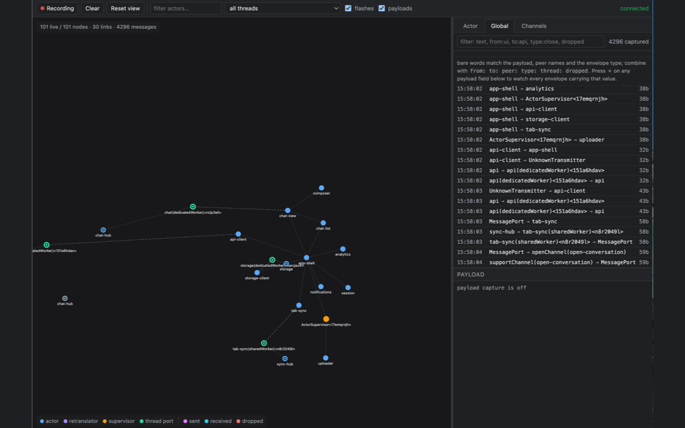

# webactor-devtools

A Chrome DevTools panel that shows the live actor graph of a [webactor](../webactor) application:
who is connected to whom, across every thread, and every envelope that travels between them.



## What you get

- **Graph** — one node per actor, retranslator, supervisor and thread port; edges are real
  `connectTransmitters` connections. Nodes of the same thread settle near each other, and cross-thread
  edges are dashed. Raw ports are not drawn — they mean nothing on their own, so a run of them collapses
  into a single pass-through edge between the nodes on either side.
- **Traffic** — nodes flash when they work: magenta on sending, cyan on receiving, red when an
  envelope was dropped by a route mismatch. Nothing is drawn travelling along an edge — real traffic is
  orders of magnitude faster than any animation, so a single envelope would appear in every segment of
  its chain at once. A busy node simply stays lit.
- **Per-actor history** — select an actor to get its incoming/outgoing envelopes with timestamps,
  peers, payload size and a collapsible payload inspector.
- **Global** — the second tab of the right pane is every envelope in one list, showing where each came
  from and where it went; clicking either endpoint opens that actor. The pane follows the selection:
  picking an actor in the graph opens **Actor**, clicking past every node opens **Global**.
- **Actor scope** — who is being debugged at all, set in the toolbar: a regular expression over actor
  names, plus a picker to tick individual actors. The two combine with OR, and an actor ticked off is
  carved back out of the pattern. Out-of-scope actors leave the graph entirely and both lists keep only
  envelopes with at least one end in scope — otherwise the traffic crossing the edge of the set would
  disappear with it. The pattern stays live, so actors created later join the scope on their own; while
  it does not compile the field turns amber and narrows nothing.
- **Filter** — one field above both panes, narrowing whichever list is open. Bare words match the
  payload, the peer names or the envelope type; `from:` `to:` `peer:` `type:` `thread:` narrow to one
  field and `dropped` keeps only envelopes a route mismatch threw away. Terms combine with AND.
- **Channels** — the third tab lists every channel `openChannel`/`supportChannel` built: its handshake
  name, both halves with the actor and thread each lives in, its state, and how much has travelled it.
  The two halves are one row — the `channelId` the opener generates and the supporter reads back off the
  envelope's route is the same on both sides, so they pair up even across a worker boundary; a `½` marks
  a channel whose peer thread never reported its side. Selecting a channel lists exactly the envelopes
  that went through it, in both threads. Closed and failed channels stay for 20 seconds with their
  reason — a `LostConnection` or a duplicate `supportChannel` is worth seeing after the fact.
- **Watched fields** — `+` next to any field in the payload inspector pins that field *and its value*
  as a chip: every envelope carrying it joins the watch list. Chips combine with OR, the typed query
  narrows whatever they let through, and each chip counts its matches. Primitives compare exactly;
  anything else compares by its normalised JSON. While a selection is on, the nodes it touches keep a
  bright ring for a few seconds and everything else fades back, so the route of one family of envelopes
  is readable at a glance.

  This is deliberately manual. Causality lives in the application's own logic, not in the transport —
  the recorder sees that an actor received `X` and later sent `Y`, never that `Y` happened *because of*
  `X`. So the panel shows participation and order in time, and the chain is yours to read.
- **Lifecycle** — created / launched / closed state per node, plus a restart counter for supervisors.
- **Workers** — actors living in dedicated workers and shared workers appear in the same graph. No
  setup in the worker: the page-side recorder attaches a private `MessageChannel` over the
  connection the app already has, and the worker relays its events back.

## Install (unpacked)

```bash
pnpm --filter webactor-devtools build     # → packages/devtools/dist
```

Then in Chrome: `chrome://extensions` → enable **Developer mode** → **Load unpacked** →
select `packages/devtools/dist`.

Installing grants nothing: there is no content script and no host permission in the manifest, so
until you allow a site the extension cannot see it. Allow one from the toolbar icon, or from the bar
the panel shows on a page it is not attached to. The page reloads itself afterwards — the hook has to
be in place before the app creates its first actor, which is also why allowing a site *registers* the
scripts for its next load instead of injecting them right away. `file://` pages need "Allow access to
file URLs" on the extension card; that switch has no API.

For iterating on the panel itself use `pnpm --filter webactor-devtools dev` (esbuild watch) and hit
the reload button on the extension card.

## Package for the Chrome Web Store

```bash
pnpm --filter webactor-devtools zip       # → packages/devtools/webactor-devtools-<version>.zip
```

The archive holds the contents of `dist`, with `manifest.json` at its root. The version comes from
`package.json` and is written into the manifest at build time — the store refuses an upload whose
version it has already seen, and two hand-kept numbers drift.

[`STORE.md`](./STORE.md) holds the listing copy, the permission justifications and the submission
checklist; [`PRIVACY.md`](./PRIVACY.md) is the policy the listing links to.

## How it is wired

```
page (MAIN world)                     extension
  webactor recorder ──► __WEBACTOR_DEVTOOLS_HOOK__  (hook.js, document_start)
                              │ window.postMessage
                              ▼
                        content.js (ISOLATED world)
                              │ runtime port
                              ▼
                        background.js ──► panel.js  (per inspected tab)
```

Both content scripts are registered by the service worker from the set of origins the user has
allowed, so the diagram above only exists on a page that was allowed.

`hook.js` only installs the sink; all recording lives in webactor itself
(`packages/webactor/src/devtools`). Without the extension the global hook is absent and the recorder
never activates: what remains is a flag check at each instrumentation point, one `WeakMap` write per
transmitter to declare its kind, one more for each pair of ports that form the two ends of an internal
channel, and three per `openChannel`/`supportChannel` to remember which channel its ends belong to.
None is skippable — a worker activates only once the page attaches to it, by which time its ports
already exist, so a kind would read as `unknown`, a channel opened earlier would be unrecognisable, and
worse, the two ends of a channel would not share a node and the graph would come apart at the thread
boundary. Measured on the load suite, ten thousand actors cost 72 ms to create with the recorder present
against 71 ms with it stripped out entirely.

While recording, attributing an envelope to its channel adds two `WeakMap` lookups per hop — 2.6 ms per
200 000 envelopes, against a preview that costs orders of magnitude more.

Worker threads cannot be reached by content scripts, so they are attached from the page instead:
the active thread sends a `__webactor_devtools__` envelope carrying a transferred `MessagePort` over
an existing connection. That envelope type is not in any `connectTransmitters` type list, so the
application never sees it.

Relays form a **tree rooted at the page**, which matters for correctness:

- a thread holding a *local* sink (the extension hook, or `enableDevtools()`) is the root and never
  accepts an upstream;
- every other thread accepts **one upstream per peer thread**, so a SharedWorker reports to every page
  that connected to it, and may collect from many children, so chains `page → worker → worker` relay
  hop by hop;
- when both ends attach over the same port — which happens whenever a second page connects to an
  already-running SharedWorker — the root wins, since it is the only end that can deliver anywhere;
- an upstream slot is freed when its port closes or the owning page unloads, so a closed tab cannot
  keep a SharedWorker from reporting to the tabs that remain;
- a message that arrives twice (two routes, or a snapshot overlapping the batch after it) is applied
  once: ids are deduplicated, while node and link events are idempotent anyway;
- channel `MessagePort`s are excluded from bridging, so a channel never adds a second bridge between
  two threads;
- every relayed batch carries the threads it has visited and is refused if it comes back around.

Without those rules two threads holding two ports between them (an actor transport plus a channel)
could each end up relaying to the other, and the relayed batches would circulate forever.

## Using the recorder without the extension

```ts
import { enableDevtools, getDevtoolsSnapshot } from 'webactor';

const stop = enableDevtools((events) => console.log(events));
// …
console.log(getDevtoolsSnapshot()); // { thread, nodes, links, messages }
stop();
```

`setDevtoolsOptions({ capturePayload, maxMessages, previewDepth, flushInterval, maxBatch })` tunes
capture; `capturePayload: false` records only shape and size.

## Tests

```bash
pnpm --filter webactor-devtools test
```

- `tests/panel.spec.ts` drives the built panel with a stubbed `chrome` API: graph building,
  message list, direction filters, payload inspector, toolbar commands, canvas paint.
- `tests/extension.spec.ts` loads `dist` as a real unpacked extension and asserts the service
  worker registers, the MAIN-world hook lands before page scripts, the recorder auto-activates,
  and events reach the background worker. A native permission prompt cannot be clicked from a test,
  so the fixture origin is pre-granted in the manifest of a throwaway copy; a separate assertion
  keeps the shipped manifest free of any static injection.

Cross-thread capture is covered on the library side by
`packages/webactor/e2e/tests/devtools.spec.ts`.
